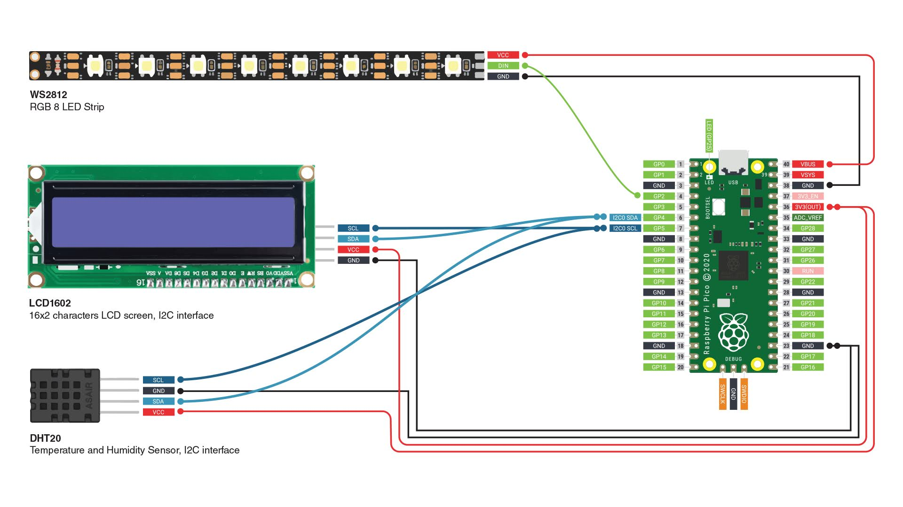

# Microcontroller Home Humidity Sensor
The Home Humidity Sensor is an embedded system built with C on the Raspberry Pi Pico. It measures humidity using a DHT20 sensor and provides both LED based and LCD text feedback to communicate humidity, system state, and errors. The project emphasizes modular firmware design, low level hardware interaction, and clear visualization of sensor data.

[Full Project description](https://eecs.engineering.oregonstate.edu/capstone/submission/pages/viewSingleProject.php?id=a0MOgZxGy3ZSn4Yr)

### File Descriptions:
1. `main.c` - Initializes hardware and runs the main program. Calls function to read the sensor, update the LED array, and update the display.
2. `sensor.c` - Contains function to initialize and read data from the humidity sensor.
3. `led_array.c` - Contains functions to initialize the LED array and set their state based on humidity levels.
5. `display.c` - Contains functions to initialize and update the display with the current humidity level.
6. `CMakeLists.txt` - Build configuration file using CMake.

### Building the .uf2 Firmware in GitHub Codespaces
1. Open codespaces, type:
   - `rm -rf build`
   - `cmake -S . -B build -G "Ninja"`
     - _Note: Add `-DPICO_BOARD=pico2` to the line above if you’re building for a Pico2W, omit otherwise_
   - `cmake --build build`
2. Download `.uf2` firmware that was created in the build folder
3. Flash Pico with that `.uf2`
   - Unplug Pico
   - Hold down BOOTSEL button
   - Plug in Pico
   - Pico should appear as RPI-RP2
   - Drag and drop `.uf2` into it

## Wiring Diagram

_Note: All GND pins on the Pico are electrically equivalent. The diagram shows specific GND pins for clarity, but any GND pin will work._

## Visualization Logic

### LED Patterns by Humidity Level
The eight-stage LED array visually indicates the level of humidity at a glance using the following thresholds:
| **Humidity Range (%)** | **LEDs Lit** |
|-------------|-------------|
| 0–19 | 1 |
| 20–29 | 2 |
| 30–39 | 3 |
| 40–49 | 4 |
| 50–59 | 5 |
| 60–69 | 6 |
| 70–79 | 7 |
| 80–100 | 8 |

### System States
Additionally, the LED array displays different patterns to indicate system states:
| **State** | **LED Activity** | **Description** |
|-------------|-------------|-------------|
| **System Ready** | 1-8 LEDs lit based on humidity | See table above |
| **Sensor Error** | LED #2 blinks | Displayed if sensor fails to respond after retries |
| **LED Error** | LED #3 blinks (nonfunctional) | LCD indicates system error |
| **LCD Error** | LED #4 blinks | Displayed if LCD display fails to respond after retries |

### LCD Display Behavior
The two-line LCD Display shows the indoor humidity in numerals, system status updates, and error messages.

| **State** | **Line 1** | **Line 2** | **Description** |
|-------------|-------------|-------------|-------------|
| **System Ready** | `Humidity: <value>%` | `n/a` | Updates with the latest reading |
| **Sensor Error** | `Error:` | `Sensor offline` | Displayed if sensor fails to respond after retries |
| **LED Error** | `Error:` | `LED array offline` | Displayed if LED array fails to respond after retries |
| **LCD Error** | n/a | n/a | LCD display nonfunctional, LED array indicates system error |